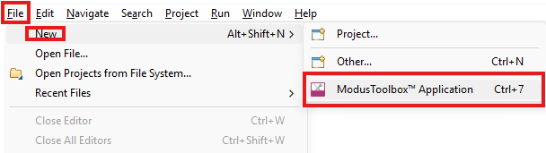
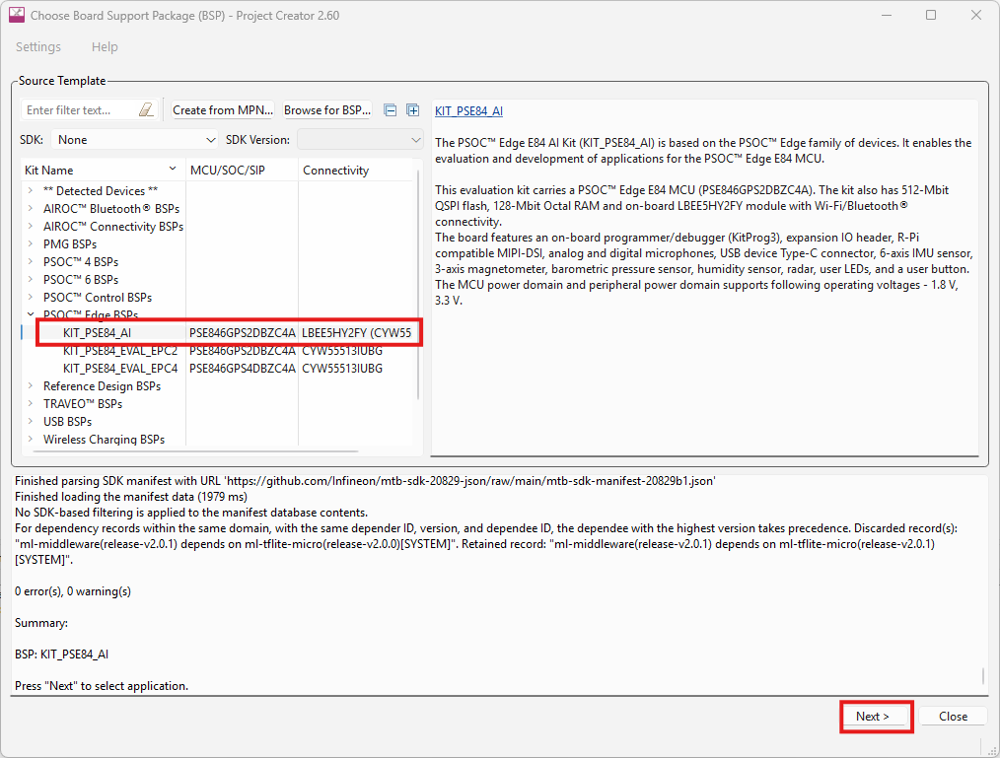
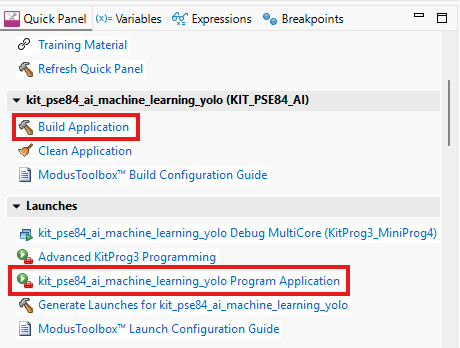

In Eclipse for ModusToolbox, select "File -> New -> ModusToolbox Application"

Then select the KIT PSE84 AI board and click "Next".

TODO: Screenshot when uploaded inside MTB.

Then click on "Build Application" and "... Program Application" to download the firmware on the PSE84 AI board.

